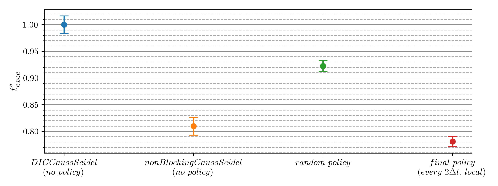
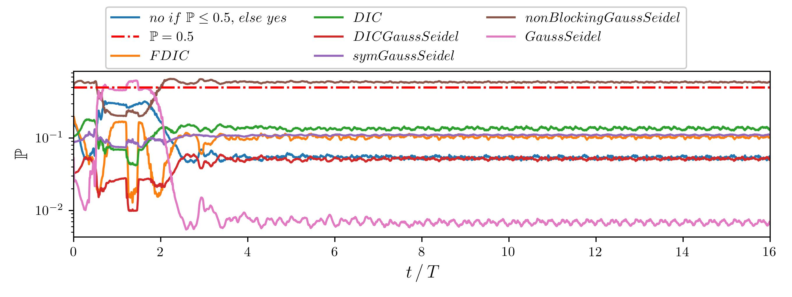
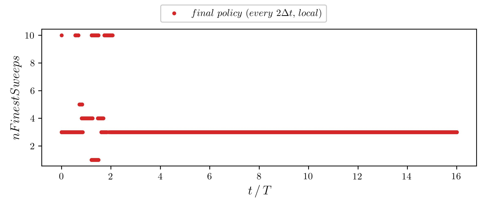

# Overview
The solution of the Poisson equation contributes a significant portion to the overall runtime in computational fluid 
dynamics (CFD) when solving the incompressible Navier-Stokes equations. Multigrid methods are frequently utilized to 
accelerate its solution, however, their performance highly depends on a series of solver settings. The optimal solver 
settings are subject to the encountered flow physics and generally unknown beforehand. Deep reinforcement learning (DRL) 
is able to efficiently find optimal control laws for complex optimization problems by interacting with an environment. 
The present thesis aims to implement a DRL training routine in order to learn optimal multigrid solver settings. 
The resulting policies are able to adjust and maintain the optimal solver settings during runtime, leading to a decrease
in the required execution time by up to *22%* compared to the default settings. The policies are able to outperform a 
priori unknown optimal solver settings by up to *3%*, as a consequence of the runtime optimization. This thesis further 
provides insights into the choice of the optimal solver settings with respect to the encountered flow physics and domain
decomposition of the simulation. The trained policies generalize to unseen environments to some degree provided the 
modeling of the flow as well as the numerical setup is similar. However, the overall generalization capabilities to 
environments that have not been part of the training are not optimal yet and remain a matter of future studies.

### Deceasing the execution time by predicting optimal solver settings ###
The DRL training routine implemented in [drlfoam](https://github.com/JanisGeise/drlfoam/tree/solver_settings) trains a policy
in order to find optimal solver settings for *GAMG* and maintain them during runtime. Currently, only for the parameters 
*smoother*, *interpolateCorrection* and *nFinestSweeps*. During execution of the simulation, the policy predicts the optimal
solver settings for the next time step based on the convergence behavior of *GAMG* in the previous time step.

For example, in the *cylinder2D* environment (*test_cases/cylinder2D*), the policy is able to decrease the required 
runtime by *22%* compared to the default settings:



*nonBlockingGaussSeidel* is hereby the fastest *smoother* (without a policy), which is generally unknown beforehand. 
*Random policy* denotes a policy predicting random solver settings, which can be seen as equivalent to guessing optimal 
solver settings. The policy is able to decrease the runtime compared to the optimal settings by a modification of the 
*GAMG* settings during runtime:



Each probability corresponds to a *smoother* and *interpolateCorrection* predicted by the policy. The *smoother* is then 
chosen based on the highest probability and alternates between *GaussSeidel* and *nonBlockingGaussSeidel* while 
*interpolateCorrection* remains switched off over the course of the simulation (probability is always lower than *50%*).
The number of the finest sweeps are increased in the first part of the simulation, contributing to the overall decrease 
in runtime:



Since the optimal solver settings depend on the flow physics encountered, training a policy for predicting the optimal
settings is significantly faster than benchmarking them manually, while the policy is additionally able to decrease the 
execution time of the simulation by modifying the solver settings during runtime.

# Getting started
The agent provided in the *test_case* directory can be included in any simulation executed with *OpenFoam*. However, the 
trained policies are only tested on the corresponding test cases, for other applications it may be necessary to train
a policy for a specific simulation (procedure is described below). The *test_cases* directory contains all the test cases 
investigated in this thesis as well as the agent and all requirements for executing simulation. The *post_processing* 
directory contains scripts for visualization and analysis.

## General information and prerequisites
In case the policy is not executed in the provided test cases, the `fvSolution` has to be modified, because the current implementation 
of the agent assumes that the target field (e.g. pressure) is the first dictionary in the `fvSolution` file. Although this may
change in future versions, at the moment the following steps have to be executed when including the
agent into simulations, which are not provided in the test cases directory:

1. modify the `fvSolution` file so that the dictionary for the field, which should be optimized comes first. An example is given
below (or refer to the provided test cases)
2. add the two additional entries *interpolateCorrection* and *nFinestSweeps* to the solver dict. **The agent assumes that there
exists a total number of exactly six entries in the solver dict** (four mandatory entries and the two additional entries)
3. include the agent in the `controlDict`. Examples can be found in the `controlDict` of the test cases provided. The specified
field name has to match the first dictionary in the `fvSolution` file, e.g. in the following example solver dict `p` has to
be defined as field name in the `controlDict`
4. modify the paths in the `Allrun` and `Allclean` scripts accordingly (compare to the `Allrun` scripts used by the test cases)

An example solver dictionary may look like:
```
solvers
{
   p
   {
      solver 	              GAMG;
      smoother 	              DICGaussSeidel;
      tolerance 	      1e-06;
      relTol 	              0.01;
      interpolateCorrection   no;
      nFinestSweeps           2;
   }
	
 ... remaining solver dicts (order doesn't matter) ...
```
The solver has to be *GAMG* in all cases, the specified settings for *smoother*,  *interpolateCorrection* and *nFinestSweeps*
are not relevant since they are modified by the agent during runtime.

**Note:** In case the policy should be trained for specific simulations, these simulations first have to be added as environment 
to [drlfoam](https://github.com/JanisGeise/drlfoam/tree/solver_settings). **If the simulations have a variable time step,
`adjustTimeStep` (defined in the `controlDict`) needs to be set either to `on` or to `yes`**. Otherwise, the training 
will crash when computing the rewards. Independently of the time step, the `timeStart` for the agent needs to be larger than the specified
finish time of the base case to avoid executing the agent when running the baseline simulation at the beginning of the training.
When executing the trained policy (when deploying / validating in the target simulation), the `timeStart` has to be set to zero, if the agent should be executed right from the 
beginning.

## Test cases
All simulations located in the *test cases* directory are *OpenFOAM* tutorials with minor modifications. The original
cases can be found under:

1. *mixerVesselAMI*:

    `$FOAM_TUTORIALS/multiphase/interFoam/RAS/`


2. *surfaceMountedCube*:

    `$FOAM_TUTORIALS/incmpressible/pimpleFoam/LES/`


3. *weirOverflow*:

    `$FOAM_TUTORIALS/multiphase/interFoam/RAS/`


4. *cylinder2D*:

    `$FOAM_TUTORIALS/incompressible/pimpleFoam/laminar/`

The policy `random_policy.pt` in each simulation directory of the `test_cases` directory is a randomly initialized 
policy created by using the `create_dummy_policy.py` script within [drlfoam](https://github.com/JanisGeise/drlfoam/tree/solver_settings).
The policy `trained_policy.pt` denotes a trained policy, which is already included in the `controlDict` as well.

### Run simulations locally
The test cases can either be executed without a container (requires native OpenFoam installation) or under the usage of 
a Singularity container.

#### without container
The test cases were tested using OpenFoam *v2206*. Prior executing the test cases, the number of subdomains may have to
be adjusted according to the available computational resources. For running a simulation, the following steps
have to be executed:

1. compile the agent by executing `./Allwmake` in a terminal
2. source the `setup-env` by executing `source setup-env`
3. `cd` into the directory of the simulation and execute the `Allrun` script

#### with container
If no native OpenFoam installation is available, simulations can be executed under the usage of Singularity containers. 
The container utilizes MPI v. 4.1.2, if the local machine used a different version, the execution of the flow solver may
not work. For running a simulation execute the following steps:

1. download and compile the container build by executing `sudo singularity build of2206-py1.12.1-cpu.sif docker://andreweiner/of_pytorch:of2206-py1.12.1-cpu`
2. by default, it is assumed that the container is located under `/test_cases/`
3. the repository or at least the directory containing the test cases needs to be located in the `/home/` directory, refer to 
[this](https://github.com/AndreWeiner/ml-cfd-lecture/issues/6) issue for more information
4. execute `source setup-env --container`
5. `cd` into the directory of the simulation and execute the `Allrun` script

### Run simulation with SLURM
On HPC clusters, the test cases can be executed using the Singularity container. The steps for executing the test cases
remain the same:
1. `module load singularity/latest`
2. `./Allwmake --container`
3. `cd` into the directory of the simulation and execute the jobscript script (the provided jobscript may need to be modified)

The [jobscript.sh](https://github.com/JanisGeise/learning_of_optimized_multigrid_solver_settings_for_CFD_applications/blob/main/test_cases/jobscript).
in the *test_cases* directory is an example shell script for executing simulations on an HPC cluster (here for the 
[Phoenix](https://www.tu-braunschweig.de/it/hpc) cluster of TU Braunschweig). The required nodes and partion names may 
have to be adjusted according to the available resources and numerical setup.

## Installation of drlfoam
The version of *drlfoam* developed in this thesis can be found [here](https://github.com/JanisGeise/drlfoam/tree/solver_settings) along with a detailed 
description of its installation (branch *solver_settings*) and examples for conducting trainings either on a local 
machine or on HPC clusters. Since the drlfoam repository is frequently updated, some instructions or dependencies may 
change in the future and are therefore not presented here in order to avoid any discrepancies between drlfoam and this 
repository.

# Troubleshooting
In case something is not working as expected or if you find any bugs, please feel free to open up a new 
[issue](https://github.com/JanisGeise/learning_of_optimized_multigrid_solver_settings_for_CFD_applications/issues).

# Report
The report of this thesis can be found under: https://zenodo.org/records/10361535

BibTex citation:

```
@mastersthesis{geise_2023_10361535,
  author       = {Geise, Janis},
  title        = {{Learning of optimized multigrid solver settings 
                   for CFD applications}},
  school       = {TU Braunschweig},
  year         = 2023,
  month        = dec,
  doi          = {10.5281/zenodo.10361535},
  url          = {https://doi.org/10.5281/zenodo.10361535}
}
```

# References
- the *RunFunctions* and *setup-env* taken directly from [drlfoam](https://github.com/OFDataCommittee/drlfoam)
- the original [drlfoam](https://github.com/OFDataCommittee/drlfoam) repository, currently maintained by
[@AndreWeiner](https://github.com/AndreWeiner/)
- the test cases used are all *OpenFoam* tutorials 